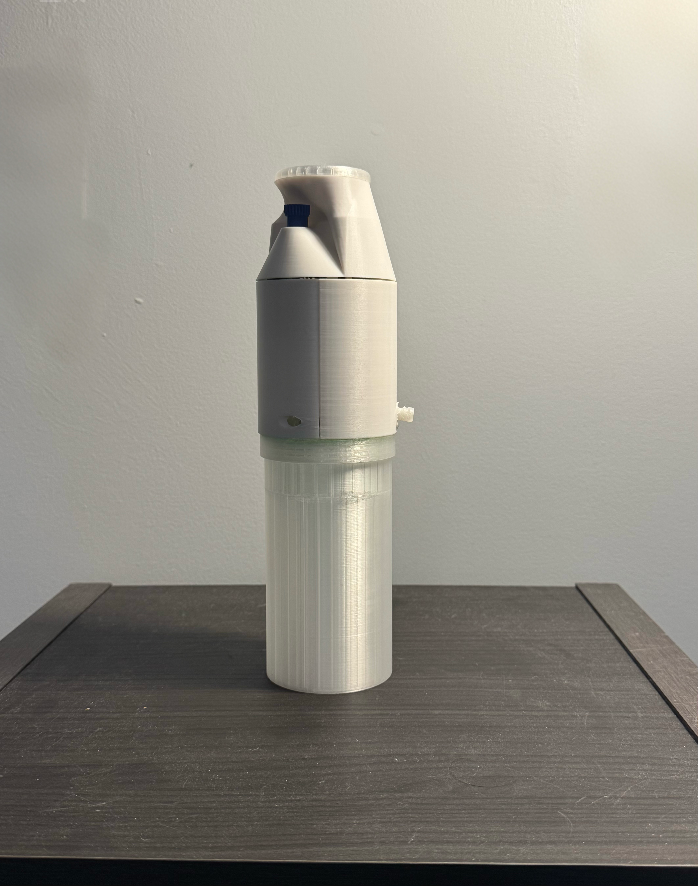
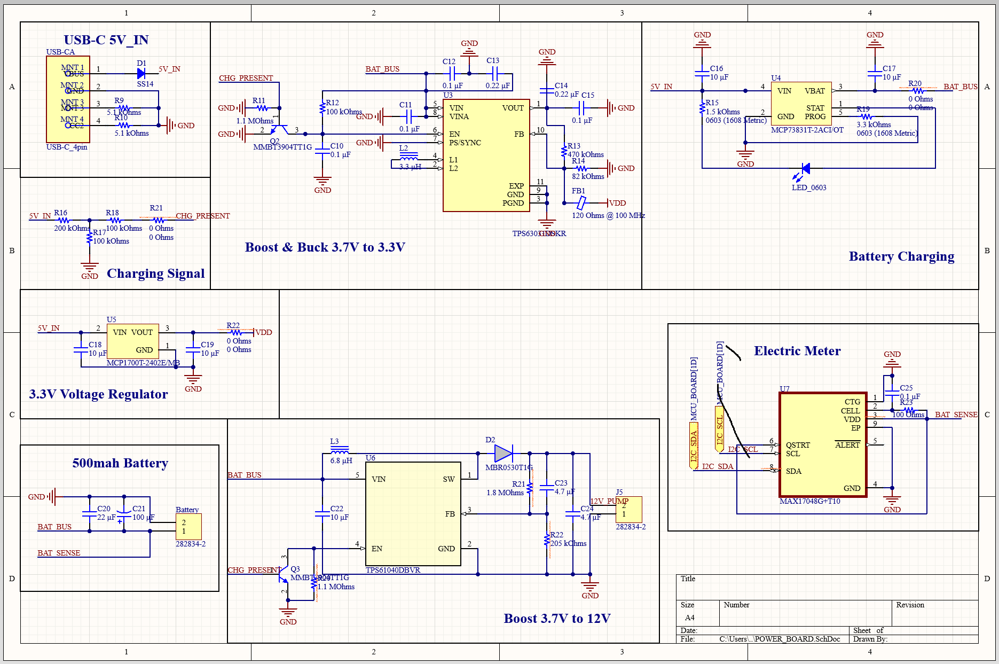
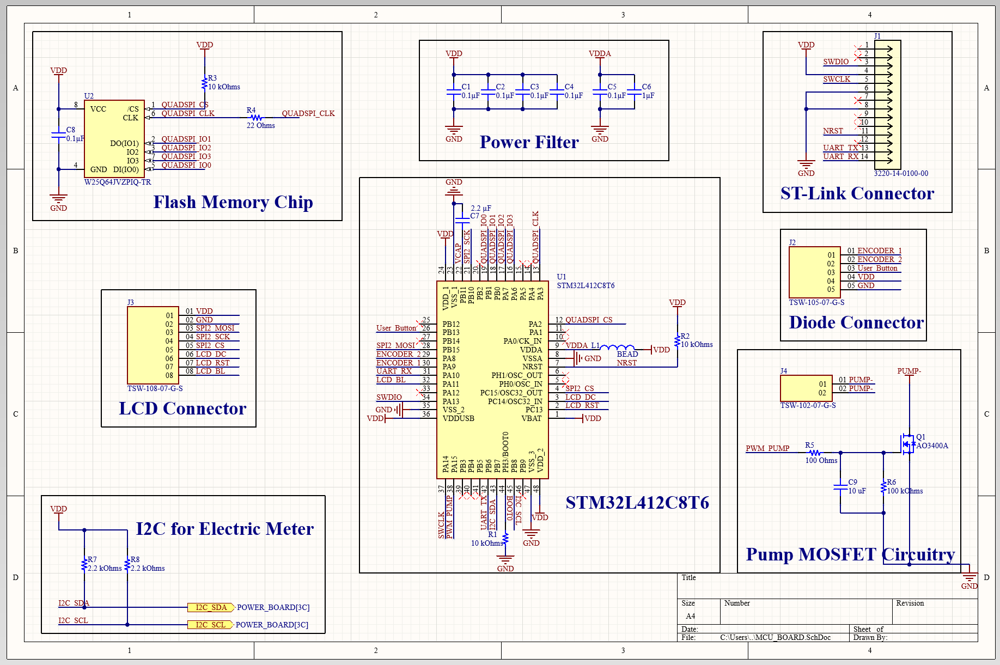
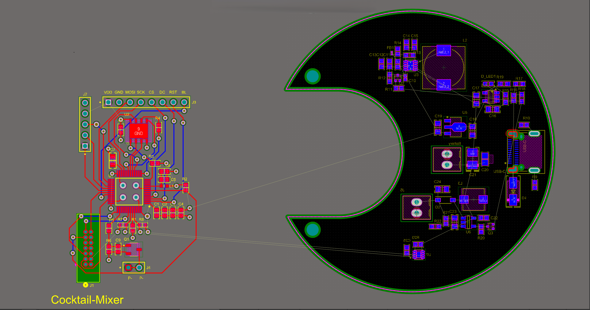
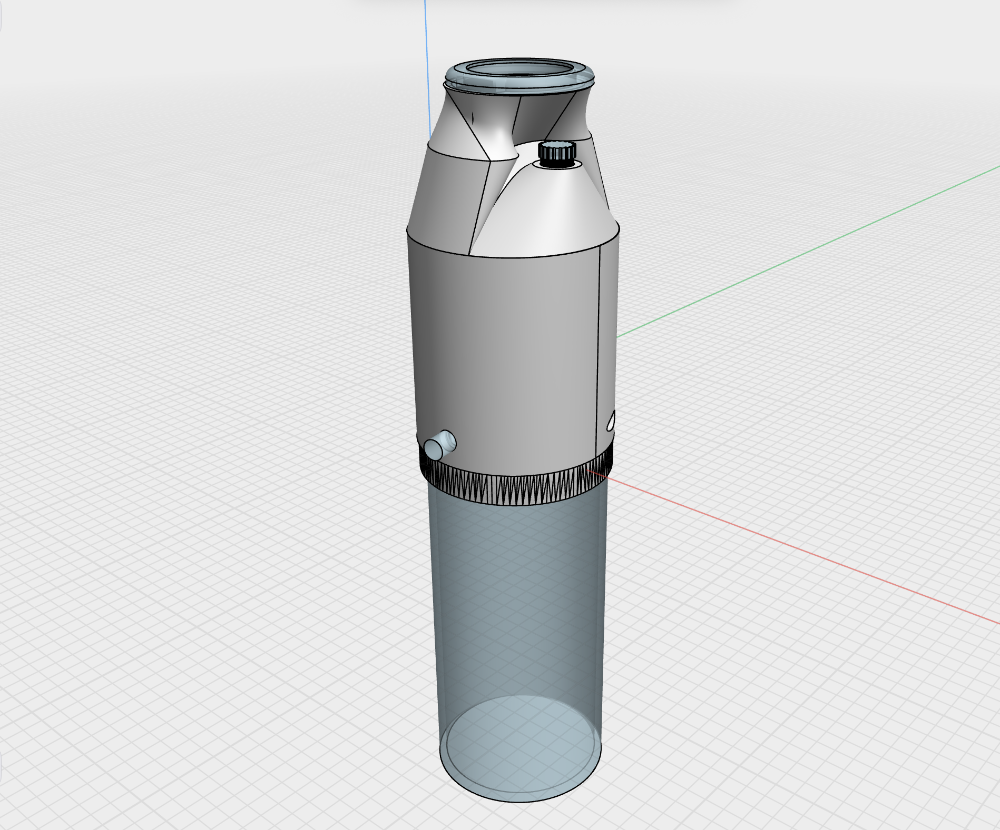
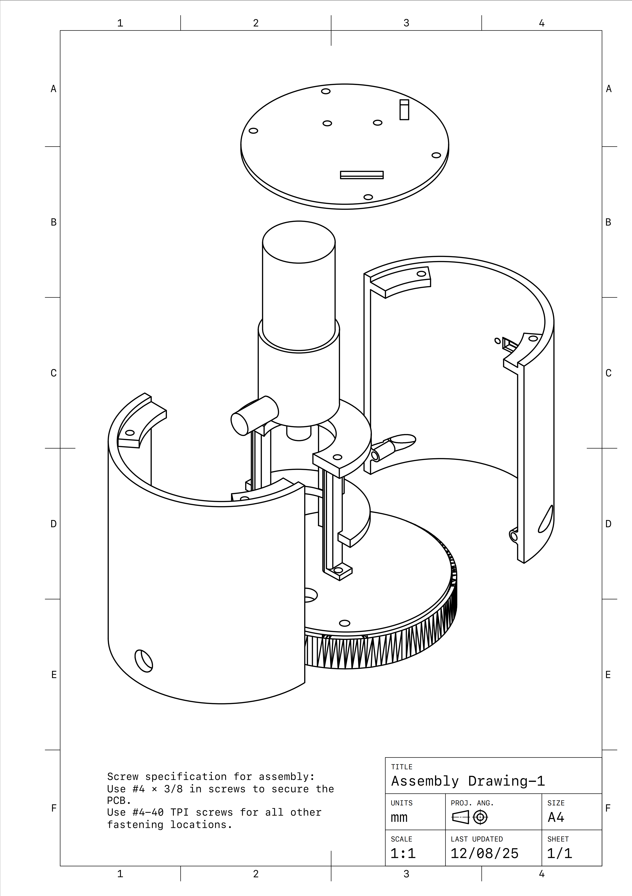
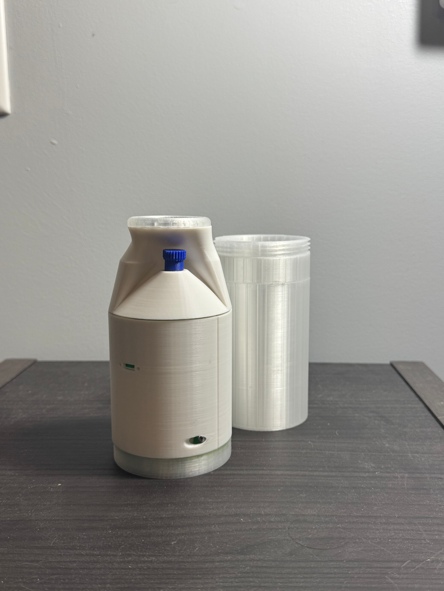
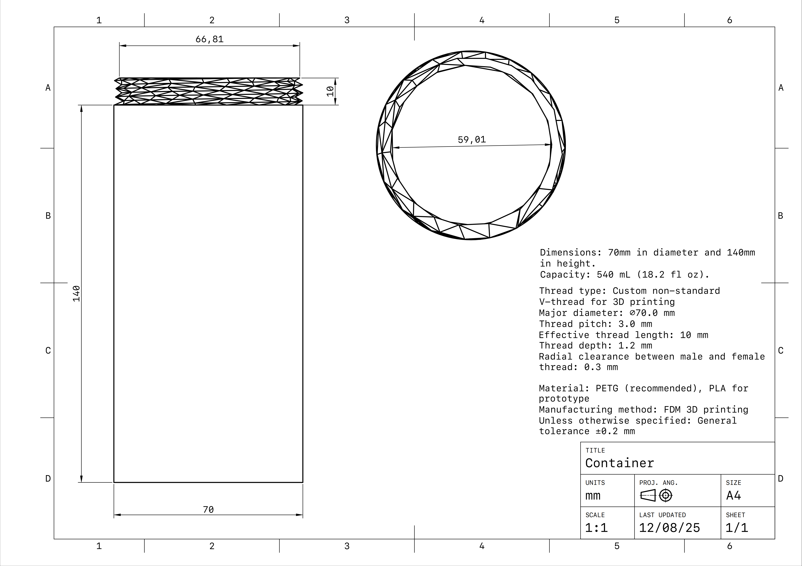
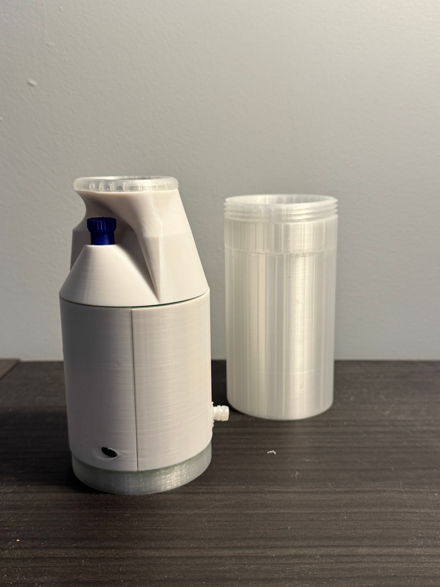
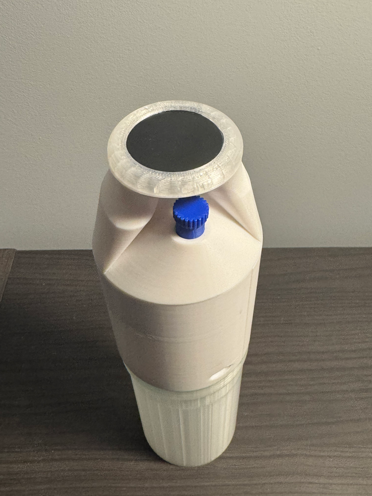

# Portable Battery-Powered Cocktail Machine

<p align="center">
  
</p>

A portable battery-powered cocktail-mixing prototype integrating custom power electronics, pump-driven fluid handling, embedded control, a rotary/LCD user interface, and a multi-part FDM-printed mechanical enclosure.

The project focused on packaging electrical, mechanical, and fluid-handling subsystems into a compact physical prototype while progressing from system architecture and subsystem testing through CAD design, assembly, and integration.

**Project period:** Fall 2025  
**Institution:** Brown University  
**Project type:** 4-person graduate engineering team project

---

## Project Goal

The project explored how a portable cocktail-mixing device could combine fluid handling, embedded electronics, battery power, and a user interface within a single handheld form factor.

The prototype incorporated:

- a battery-powered pump for fluid movement;
- an STM32-based embedded control system;
- LCD and rotary-control interfaces;
- USB-C power input and Li-ion battery charging;
- separate power rails for logic electronics and the pump;
- a removable liquid container;
- a custom multi-part enclosure designed for FDM fabrication.

The goal was to move beyond a conceptual product model and develop a physically integrated prototype in which the electrical and mechanical subsystems could be assembled and tested together.

---

## Highlights

- **1S Li-ion battery-powered architecture**
- USB-C 5-V power input and battery charging
- Dedicated regulated logic supply
- **12-V boost rail** for pump operation
- MAX17048 battery monitoring
- STM32L412C8T6-based control architecture
- LCD + rotary encoder / button interface
- Pump control through MOSFET switching
- Full Fusion 360 mechanical assembly
- Custom FDM-printable threaded container interface
- Dedicated PCB, pump, and LCD mounting features
- Detailed mechanical assembly and part drawings
- Bench pump testing and full physical prototype assembly

---

## My Contributions

My primary ownership was in the **power electronics, mechanical design, prototype integration, and team coordination** portions of the project.

- Led the four-person team through design reviews, subsystem development, and prototype integration.
- Co-developed the overall electrical schematic and owned the power-management section.
- Designed the 1S Li-ion power architecture, including USB-C input, battery charging, logic power regulation, 12-V pump power conversion, and battery monitoring.
- Designed the complete mechanical enclosure and assembly in Fusion 360.
- Developed custom FDM-printable threaded interfaces and mechanical clearances for the removable container.
- Designed dedicated mounting structures for the PCB, pump, LCD, and enclosure components.
- Produced detailed mechanical part and assembly drawings.
- Coordinated electrical, firmware, and mechanical integration toward the completed physical prototype.
- Supported subsystem testing and final prototype assembly.

> **Contribution boundary:** The MCU/control schematic and most of the embedded firmware were primarily developed by teammates. The PCB layout shown in this repository was not completed or fabricated and is included only as work-in-progress design documentation.

---

## System Architecture

The prototype combines two main electrical power domains with an embedded control and fluid-handling path.

```text
                 USB-C 5 V
                     │
                     ▼
              Battery Charging
                     │
                 1S Li-ion
                     │
            ┌────────┴────────┐
            │                 │
            ▼                 ▼
       Logic Supply       12-V Boost
            │                 │
            ▼                 ▼
     STM32 + Display         Pump
            │                 │
     Encoder / Button         │
            │                 ▼
            └──── Control ──► Fluid Path
                              │
                              ▼
                     Removable Container
```

Battery state is monitored electrically and communicated to the control system, while the higher-voltage pump rail is generated separately from the logic supply.

The resulting architecture allowed low-voltage embedded electronics and the higher-power pump subsystem to operate from the same portable battery source.

---

## Electrical Design

### Power Management

<p align="center">
  
</p>

My primary electrical contribution was the power-management schematic.

The design includes:

| Function | Implementation |
| --- | --- |
| External input | USB-C 5 V |
| Battery | 1S Li-ion, 500 mAh |
| Battery charging | MCP73831 |
| Logic power conversion | TPS63031 buck-boost |
| Pump supply | TPS61040 boost converter |
| Pump rail | 12 V |
| Battery monitoring | MAX17048 |

The power architecture separates the low-voltage logic domain from the pump supply while allowing both to operate from the same single-cell battery.

The charging section accepts 5-V input through USB-C and charges the 1S Li-ion battery. The battery rail then feeds the logic-power and pump-power conversion stages.

---

### Control Electronics

<p align="center">
  
</p>

The control side of the system includes:

- `STM32L412C8T6`
- external flash memory
- LCD interface
- rotary encoder / user-button interface
- ST-Link / SWD programming connection
- I2C connection to the battery-monitoring circuit
- pump MOSFET control

> **Team contribution note:** This MCU/control schematic was primarily developed by my teammate and is shown here to document the architecture of the complete system. My electrical ownership was concentrated on the power-management design shown above.

---

### PCB Layout — Work in Progress

<p align="center">
  
</p>

A custom PCB implementation was started during the project, including board-shape development, component placement, and partial routing.

The layout was **not completed or fabricated**, and no custom-board bring-up or validation is claimed.

It is included here as design-process documentation rather than as a finished PCB implementation.

---

## Mechanical Design

The mechanical system was designed in Fusion 360 as a multi-part assembly intended for FDM prototyping.

<p align="center">
  
</p>

The enclosure had to package several different subsystems within a compact cylindrical product:

```text
Top Interface
├── LCD
├── Rotary Control
└── Top Enclosure

Main Body
├── PCB
├── Battery
├── Pump
├── Wiring
└── Fluid Connections

Lower Interface
└── Removable Liquid Container
```

Mechanical design therefore focused not only on external appearance, but also on internal component placement, mounting, assembly access, and printable interfaces.

---

### Assembly Design

<p align="center">
  
</p>

The exploded assembly drawing documents the relationship between the enclosure, internal supports, fluid-handling components, electronics, and removable container.

[View full exploded assembly drawing (PDF)](mechanical/assembly-exploded.pdf)

A second drawing documents the completed assembly and overall component relationship:

[View assembly overview (PDF)](mechanical/assembly-overview.pdf)

---

### Removable Container & Printable Thread

<p align="center">
  
</p>

The lower container was designed as a removable module using a custom FDM-printable threaded connection.

The mechanical drawing specifies:

| Parameter | Design value |
| --- | ---: |
| Container diameter | 70 mm |
| Container height | 140 mm |
| Nominal capacity | 540 mL |
| Thread pitch | 3.0 mm |
| Thread depth | 1.2 mm |
| Effective thread length | 10 mm |
| Radial clearance | 0.3 mm |

The clearance and relatively coarse thread geometry were selected to make the connection practical to prototype using FDM printing rather than relying on a fine production-machined thread.

<p align="center">
  
</p>

[View full container and thread drawing (PDF)](mechanical/container-thread.pdf)

---

### Enclosure & Component Mounting

The main enclosure was divided into multiple printable parts so that internal components could be installed and serviced during prototype assembly.

<p align="center">
  
</p>

The enclosure incorporates dedicated geometry for:

- PCB positioning;
- pump support;
- LCD mounting;
- rotary-control access;
- fluid connections;
- screw-based assembly;
- removable-container attachment.

Detailed drawings are available for the primary enclosure components:

- [Main body shell drawing (PDF)](mechanical/main-body-shell.pdf)
- [Top shell and knob drawing (PDF)](mechanical/top-shell-knob.pdf)

---

## User Interface Integration

<p align="center">
  
</p>

The upper enclosure integrates the display and rotary control into the physical product form.

The interface design required the mechanical CAD to account for component positioning, external access, fastening, and clearances while preserving the overall enclosure shape.

The control interface was therefore treated as an electromechanical integration problem rather than as an isolated cosmetic feature.

---

## Prototype & Testing

The project progressed through subsystem testing before full mechanical integration.

### Pump Subsystem Test

[▶ Watch pump subsystem test](demo/pump-test.mov)

The pump was tested separately as part of the fluid-handling development before integration into the final enclosure.

This provided an early functional check of the pump and liquid-transfer subsystem independent of the complete mechanical assembly.

### Assembly Demonstration

[▶ Watch prototype assembly demonstration](demo/assembly-demo.mp4)

The assembly demonstration shows the physical integration of the enclosure components and internal hardware into the completed prototype.

The final build combined:

- the FDM-printed enclosure;
- removable container;
- pump and fluid path;
- embedded electronics;
- battery system;
- display and user control;
- mechanical mounting hardware.

---

## Engineering Limitations & Lessons

### 1. Custom PCB Was Not Completed

The project progressed from schematic design into PCB placement and partial routing, but the custom PCB was not completed or fabricated.

As a result, this repository does not claim custom-board bring-up, assembly, or electrical validation.

A future revision could complete the layout, perform DRC review, fabricate the board, and validate the power and control sections independently before full-system integration.

### 2. FDM-Printed Interfaces Require Manufacturing-Aware Geometry

Features such as the removable-container thread cannot simply reproduce fine machined-thread geometry.

The prototype used a relatively coarse **3-mm thread pitch** and **0.3-mm radial clearance** to create a more printable and assembleable interface.

This reinforced the importance of designing mechanical features around the manufacturing process rather than only around ideal CAD geometry.

### 3. Packaging Drives Cross-Domain Tradeoffs

The enclosure had to accommodate the PCB, pump, battery, display, wiring, fluid connections, fasteners, and removable container within a compact form.

Changes to one subsystem therefore affected the others.

This made mechanical packaging and subsystem coordination central parts of the engineering process rather than tasks performed only after the electrical design was complete.

### 4. Prototype Validation Scope

The preserved project evidence includes schematic development, pump subsystem testing, mechanical drawings, assembly, and a completed physical prototype.

It does not represent a production-qualified product or a completed reliability-validation program.

The project is presented here as an integrated engineering prototype and design case study.

---

## Repository Scope

This repository is intended as an **engineering portfolio and technical case study**, not as a complete open-source hardware or software release.

Included materials:

- prototype photographs;
- selected electrical schematics;
- work-in-progress PCB layout documentation;
- mechanical CAD overview;
- mechanical engineering drawings in PNG and PDF format;
- subsystem and assembly demonstration videos.

The following materials are intentionally not published:

- the complete Altium project;
- complete Fusion 360 / CAD source files;
- manufacturing files for an unfinished PCB;
- teammate-developed firmware source;
- complete course-development archives;
- third-party libraries and reference files.

The published material is intended to demonstrate the project's power-electronics design, mechanical development, system integration, prototyping, and engineering documentation.

---

## Acknowledgments

This project was developed at **Brown University** as a four-person engineering team project.

I am grateful to my teammates for their work on the MCU/control electronics, embedded firmware, and other parts of the integrated prototype.
